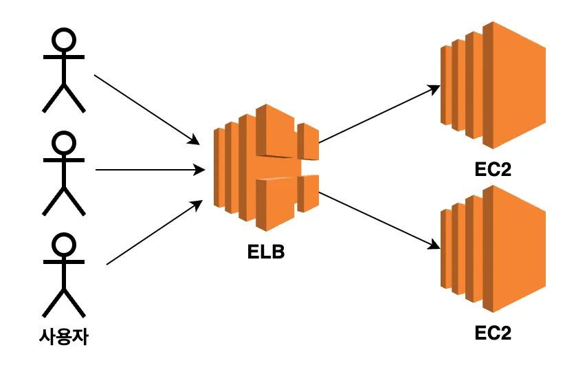
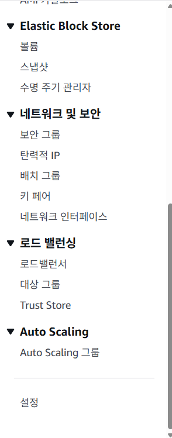
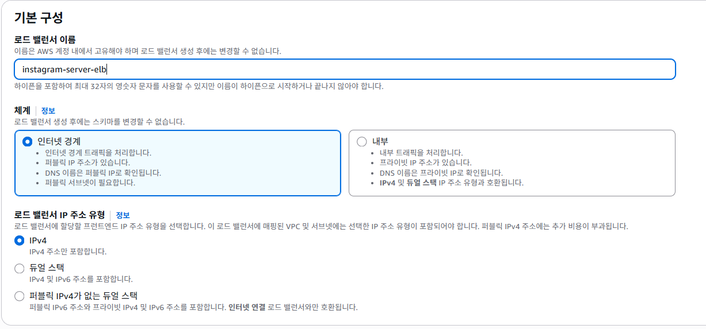
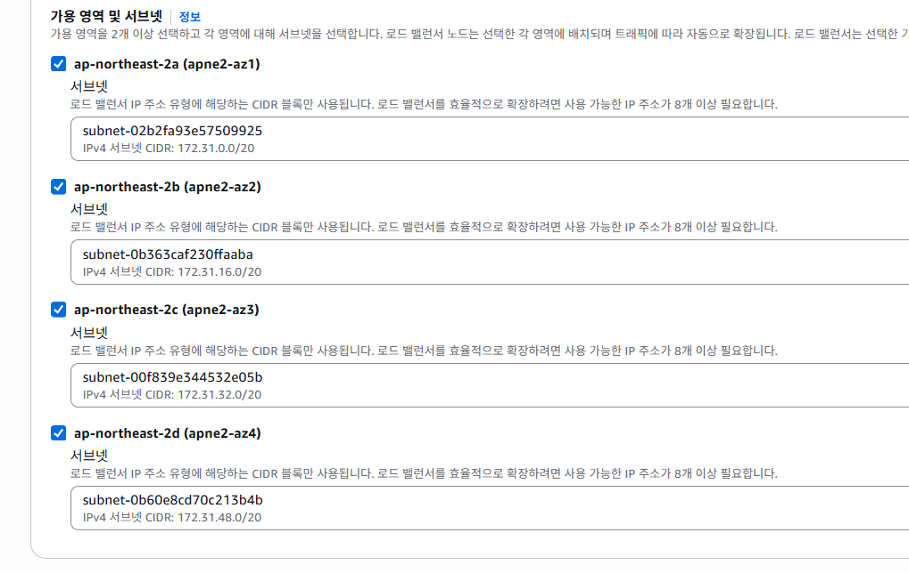
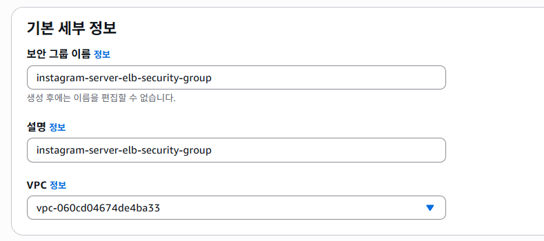
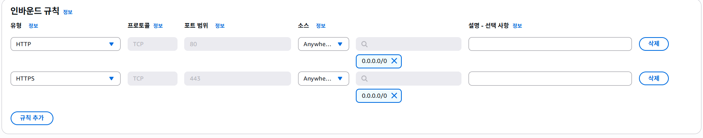
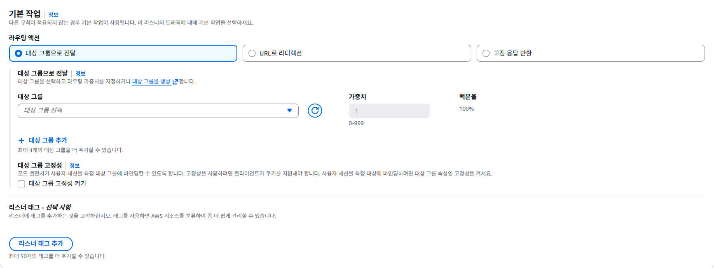
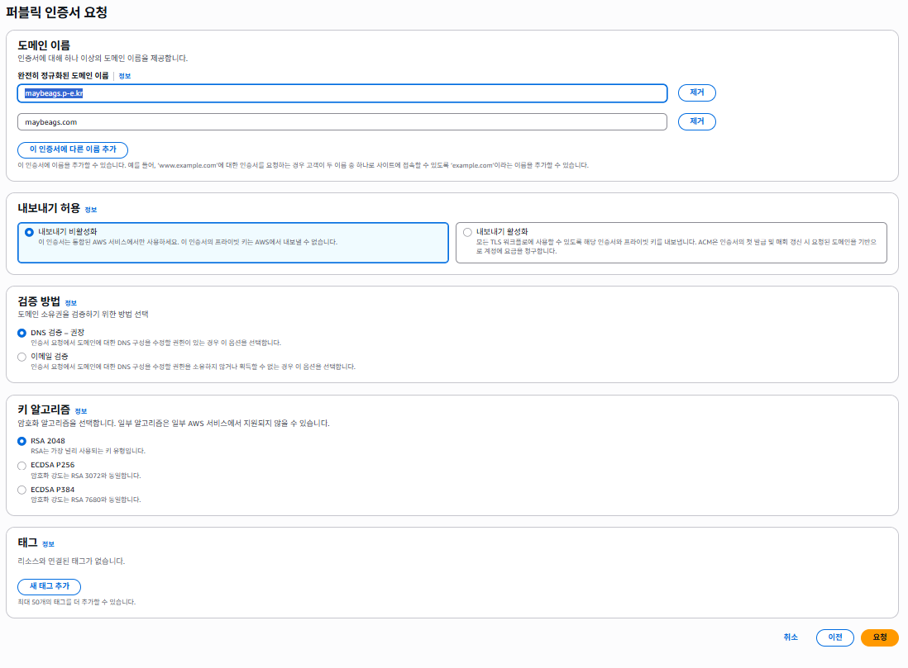
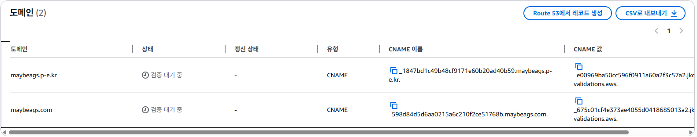

# 입실 체크 해주세요 !! 💌

# Route53으로 도메인 주소 연결하기
## 도메인(domain)
- 문자로 만든 컴퓨터 주소.
- IP 주소가 인터넷에서 특정 컴퓨터를 가리키는 역할을 하므로 통신을 하려면 이를 알아야만 했는데, 이 컴퓨터 주소를 기억하기 쉬운 문자로 나타내는 방법을 -> 도메인이라고 한다.

### 서브도메인(subdomain)
예를 들어 naver.com의 서비스를 이용하다 보면 map.naver.com, blog.naver.com과 같은 주소를 확인할 수 있는데, 이때의 `_.naver.com` 형태의 도메인을 서브 도메인이라고 합니다.
- 서브 도메인은 하나의 도메인 아래에서 여러 서비스를 구분하여 관리할 때 사용.
- route 53으로 도메인 하나만 구입하면 `_.여러분도메인.com`의 모든 서브 도메인도 이용 가능합니다.

### 웹 서비스에서 도메인을 적용하는 이유
웹 사이트는 데이터를 받아오기 위해서 백엔드의 API 서버와 통신하는 경우가 많습니다. 이 때 쉽게 기억하기 위해서라도 도메인을 적용하기도 하지만 더 중요한 것은 HTTPS를 적용할 수 있기 때문입니다. 일반적으로 IP 주소에서는 HTTPS를 적용할 수 없으므로 실무에서 서비스를 운영할 때 도메인을 운영하는 편.

## DNS(Domain Name System)
사람은 도메인 주소를 잘 기억하고 컴퓨터는 숫자를 더 효율적으로 처리합니다. 즉 컴퓨터는 IP 주소를 활용할 겁니다. 이러한 차이를 해결하기 위해서 DNS 개념이 만들어졌습니다.
- DNS란 _도메인 주소를 IP 주소로 변환하는 시스템(서버)_ 


# Route 53에서 도메인 구매
1. 로그인 이후에 console 검색에서 route 53을 검색하여 대시보드로 들어갑니다.
2. 처음이라면 우측에 주황색 `시작하기` 버튼이 있을 겁니다.
3. 아니신 분들은 `도메인 등록` 버튼을 누르시면 됩니다.
4. 적정 도메인을 검색한 후에 결제를 진행합니다.

5. 연락처 정보를 입력하게 되는데 email 주소는 정확하게 입력하셔야 합니다(검증을 합니다).


6. 대충 구매에 성공하면 10 - 20 분 정도 후에 도메인 등록이 활성화됩니다.

# 무료 도메인 이용 방법
내도메인 한국 검색 -> 일단 도메인 발급까지 시도했습니다.

어제 EC2를 지우지 않았다면 해당 탄력적 IP와 방금 발급받은 도메인을 연결하는 작업을 했을겁니다.

-> 추후 개인 학습으로 꼭 해보시기 바랍니다.

# ELB으로 안전한 백엔드 서버 만들기
일반적으로 웹 서비스에서 백엔드 서버는 프론트엔드와 서로 데이터를 주고 받으면서 요청을 처리합니다. 이 때 주고받는 데이터가 외부에 노출되지 않도록 하려면 HTTPS를 사용하여 통신할 수 있도록 설정할 필요가 있습니다.


## HTTP vs. HTTPS
HTTP는 주고 받는 데이터를 암호화하지 않아서 중간에 누군가가 데이터를 가로챌 수도 있습니다. 예를 들어 로그인을 하려고 username, password를 서버로 보냈을 때 이 데이터를 해커가 가로채는 것이 가능하다는 의미가 됩니다.
이상의 보안 문제를 해결하기 위해 개발된 것이 HTTPS(HyperText Transfer Protocol Secure)입니다.

- HTTPS : 클라이언트와 서버 간에 주고 받는 데이터를 암호화해서 통신하는 방식

## HTTPS의 적용 이유
1. 보안 강화
2. 검색엔진 최적화(SEO : Search Engine Optimization) : 구글, 네이버와 같은 검색 엔진에서 HTTPS를 더 높은 순위로 올려주는 경향이 있습니다. 보안 이슈가 있는 서비스를 상위로 올렸다가 입을 타격을 막기 위해서 HTTPS 처리가 된 서비스를 우선 노출하는 편.

## ELB(Elastic Load Balancing)
- AWS에서 제공하는 Load Balancer 서비스 자체를 의미함.
- 로드 밸런서란? : 트래픽을 여러 서버에 걸쳐 분산하는 장치로, 특정 서버에 트래픽이 집중되는 것을 방지하고, 
장애가 발생하더라도 정상적인 서버로 트래픽을 전달할 수 있도록 함.


## ELB의 적용 아키텍처

ELB 적용 전 아키텍처



ELB 적용 후 아키텍처

ELB 사용 전에는 EC2의 IP 주소 또는 도메인 주소에 직접 요청을 보내는 구조이지만,
ELB를 도입하게 되면 사용자들이 _직접적으로 EC2에 요청을 보내지 않고_ ELB를 향해
요청을 보내도록 구성합니다. 그러면 EC2에 직접 도메인을 다는게 아니라 ELB에
도메인을 연결하고, HTTPS도 ELB 도메인에 적용시키도록 할 예정입니다.

## ELB 세팅하기 - 기본 구성파트
0. 리전 선택하셔야합니다.
1. EC2의 좌측 하단에 로드밸런서 선택

2. 로드 밸런서 유형 - Application Load Balancer 선택 : HTTP, HTTPS에 대한
특징 활용을 위해.
3. 기본 구성

이렇게 설정했습니다.
4. 네트워크 매핑
가용영역에 제한을 두지 않고 모든 영역에 트래픽을 보낼 수 있도록 전부 체크.


## ELB 세팅하기 - 보안 그룹



- ELB 특성 상 인바운드 규칙에 80(HTTP), 443(HTTPS) 포트로 모든 IP에 대해 요청을 받을 수 있도록 설정해야 합니다.

## ELB 세팅하기 - 리스너 및 라우팅 / 헬스 체크
1. 대상 그룹(Target Group) 설정
  - 리스너 및 라우팅 설정은 ELB로 들어온 요청을 어떤 EC2 인스턴스로 전달할건지를 설정하는 부분

  - ELB로 들어온 요청을 _어떤 곳_ 으로 전달해야하는데, 여기서 그 _어떤 곳_ 을 `대상 그룹(Target Group)`이라고 합니다. 즉, ELB로 들어온 요청을 어디로 보낼 지에 대한 대상그룹을 생성할겁니다.

  
  

2. 상태 검사 설정하기
- ELB의 부가 기능으로 상태 검사(= Health Check) 기능이 있습니다.
  - ELB로 들어온 요청을 대상 그룹에 있는 여러 EC2 인스턴스로 전달하는 역할을 하는데, 특정 EC2 인스턴스 내에 서버가 예상하지 못한 에러로 고장났다고 가정했을 때, ELB는 고장난 서버에 요청을 보내는 것이 비효율적인 행동이 될겁니다.

  - 이상의 상황을 방지하기 위해 ELB는 주기적으로(default 30초) 대상 그룹에 속해있는 각각의 EC2 인스턴스에 요청을 보내봅니다. 해당 요청에 대해 200 OK가 응답으로 날아온다면 서버가 정상적으로 동작한다고 판단하고, 아니라면 서버가 고장났다고 판단하여 해당 EC2 인스턴스로는 요청(트래픽)을 날리지 않게 됩니다.

  - 이 과정을 통해 효율적인 요청 분배가 가능해집니다.

## HTTPS 적용을 위한 인증서 발급 받기
1. AWS Certificate Manager 서비스





2. 이상의 상황을 확인했을 때, 인증서 발급 이후 Route 53을 통해서 도메인 검증이 들어간다는 것을 확인할 수 있습니다. 그렇다면 현재 상황에서 한글 무료 도메인을 발급받은 우리들은 HTTPS를 정상적으로 _AWS 내에서 처리하는 것이 힘들다_ 라는 결론이 나올 수 있겠습니다.

3. 이상을 해결하기 위해서 nginx와 certbot을 활용하여 ELB가 아니라 EC2 내부에 nginx, certbot을 설치한 후에 HTTPS를 활용하는 방법을 사용할 수 있겠습니다.

4. 근데 문제는 애초에 Route 53에 레코드가 있다면 나머지 도메인들에 대해서 알아서 인증서가 나와서 HTTPS를 적용할 수도 있는데 현재 저희 상황에서는 애초에 Route 53 레코드가 없기 때문에 결국 nginx만 유일한 대안이 될 수도 있다는 점입니다.

5. 참고 : 검증에는 3 - 10 분 정도 걸립니다.

## 검증이 안될 경우를 대비했던 Nginx, Certbot
1. 현업에서는 ELB와 Certbot 중에 뭘 더 많이 쓰는가?
  - ELB를 더 많이 씁니다. HTTPS 설정이 쉽기도 하고 HTTPS 인증서 만료 기간 갱신도 알아서 해주기 때문이빈다.

2. 그러면 Nginx를 활용한 Certbot은 왜 쓰는가?
  - _비용_ 때문에. ELB는 사용하는 것 자체로 돈이 좀 듭니다. 그래서 학생들이 free tier 기간이 지나게 되면 가격 부담이 좀 돼서 해당 방법을 주로 사용합니다.
  - 그러면 현재 우리 목표는 ELB의 개념과 이용 가능한 서비스를 명확하게 알고 있는 상황에서 Nginx, Certbot을 활용하는 방법을 사용하도록 하겠습니다.


## EC2 인스턴스에 Certbot 적용 과정
1. EC2 연결에 들어가서 jdk를 설치합니다(어제 했음)

2. git clone을 할겁니다.
```yml
server:
  port: 3000
```
Nginx를 80번 포트에서 실행시킬 예정이기 때문에 springboot server 포트 넘버를 임의로 3000번으로 바꿔놨습니다.

3. nignx 설치
```
sudo apt update && sudo apt install nginx
```
4. nginx 설치 여부 확인
```
sudo service nginx status
```

5. Certbot 설치
```
sudo snap install --classic certbot
sudo ls -s /snap/bin/certbot /user/bin/certbot
```
6. Certbot 설치 여부 확인
```
certbot --version
```
7. SSL 인증서 발급받기
- EC2와 domain이 서로 연결이 되어있어야 가능합니다.
```
sudo certbot --nginx -d <도메인 주소>
# 예시
sudo certbot --nginx -d maybeags.o-r.kr
```

8. 현재까지의 상황에서 maybeags.o-r.kr로 접속했을 때 수행이
되지 않는다는 점을 확인할 수 있습니다.
  - 상황을 점검해보면,
  - git clone을 받아서 다수의 project들을 받았고,
  - 그 중 우리는 ec2-spring-boot-sample의 .yml 파일의
    port를 3000번으로 수정해놨습니다.
  - 그리고 nginx를 설치했고,
  - certbot도 설치했습니다.
  - 그리고 domain과 탄력적 ip를 연결을 해둔 상태입니다.

```
sudo vi /etc/nginx/sites-available/default
```
이상의 예시 화면

```
server {
  listen 80 default_server;
  listen [::]:80 default_server;

  root /var/www/html;

  server_name maybeags.o-r.kr;

  location / {
    proxy_pass http://localhost:3000/;
  }
}
```